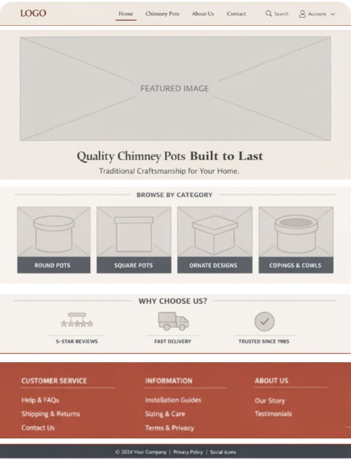
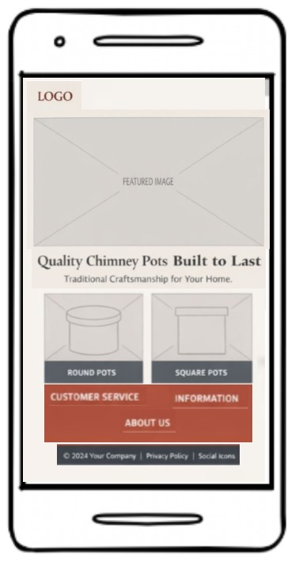

# The Chimney Pot Shop

This project is to develop a retail-focused website for a chimney pot specialist, designed to showcase products, provide practical information, and support customers in choosing the correct chimney pots for their property.

From a user perspective, visitors should be able to browse the full range of chimney pots, view detailed product information and specifications, and access guidance on suitability, installation, and maintenance. In future iterations, users may also be able to make enquiries or purchases directly through the site.

In terms of design, a clean and minimal approach is taken to allow product photography and technical detail to take priority. A cohesive colour palette and consistent typography will be used throughout the site to reinforce the brand's focus on quality, durability, and traditional craftsmanship. The layout is designed to be clear and intuitive, enhancing usability and ensuring customers can easily find the information they need with confidence.

A responsive site layout enables easy navigation on all devices.

## Desktop

## Mobile

## UX Design

Font Awesome icons were used for the site icons, e.g. the social media icons in the footer.

**Garamond** font was used for the primary headers and titles.

**Roboto** font was used for all other secondary text.

## Colour Palette

A simple colour palette was chosen to feel solid, traditional, and trustworthy, with natural tones that reference clay, brick, slate, and mortar.

## Home Page Wireframe Design

## Product Detail Page Wireframe Design

## User Stories

**As a site admin I want to be able to create, edit and delete products.**
- When logged in as admin product can be created, edited and deleted from the admin page.

**As a site user, I can view a list of products and click on the Product I want to view.**
- A list of Products is displayed on the front page
- Multiple Products are listed and paginated

**As a Site User, I can click on a Product so that I can see an image, read the description and see the price.**
- When a Product title is clicked, a detailed view of the individual Product is displayed.

**As a Site Admin I can create draft Products so that I can finish writing the content later, prior to publishing.**
- As a logged in Admin, a draft Product item can be saved.
- As a logged in Admin the content can be finished at a later time.

**As a Site User I can view reviews on an individual Product**
- Given one or more user comments the user can view them.
- Given one or more user comments the admin can view them.

**As a Site User I can leave reviews and upload photos on a Product**
- Comments need to be approved by an admin user
- Approved comments are listed on the individual Product page

**As a Site User I can modify or delete my review on a Product**
- A logged in user can modify their own comments
- A logged in user can delete their own comments

**As a site admin I can approve/disapprove reviews in order to filter out objectionable comments**
- Admin can approve a comment
- Admin can un-approve a comment

**As a Site User, I can click on the About link and read about the site.**
- When the About link is clicked, the about page is displayed.

**As a Site Admin, I can create or update the about page.**
- The About app is visible in the admin panel
- The About app is accessible to Admin users

**As a site user I can fill in a contact form so that I can submit a message to the site owner.**
- Contact form is submitted and feedback given

**As a Site Admin I can mark contact messages as "read".**
- Admin can mark messages as read

**As a Site User I can register an account so that I can review Products.**
- Given an email a user can register an account and log in.
- When the user is logged in they can comment.

**As a site user/admin I can login so that I can access all of available content.**
- User can login and see the full range of available menus.

**As a site user/admin I can logout so that I can leave the site safely.**
- User/admin can logout successfully

**As a site user I want to be able to search for specific products.**

**As a site user I want to be able to order products.**

**As a site user I want to be able to save favorite products and comment on them.**

The completed sprint was composed of 16 separate items.

Having used the MoSCoW approach to prioritise, 8 were classified as "Must-Have" making up less than 60% of the tasks as recommended. The rest of the first sprint was made up of "Should-Have" and "Could-Have" items. Future development were reflected in the "Wont-Have" items.

## Features

### Home page

The home page of the site offers users a grid of Products.  They can then to click on an individual Product to read the details.

### Navigation Bar

Navigation is provided via a bootstrap navbar, and is fully responsive.

### The Footer

The page footer is a simple arrangement of 3 social media icons.

### Sign Up

The site has a facility to sign up as a user in order to make, edit or delete your own reviews on Products.

### Sign In

The site has a facility to sign in, once you have created a user account, in order to make, edit or delete your own reviews on Products.

### Sign Out

The site has a facility for a user to sign out of their account.

### Admin

The site has a facility for designated administrators to sign in, in order to administrate the site via the standard Django admin interface.

### Entity Relationship Diagram

The following data structure was created for the project.

## Testing

### Manual Testing

### Lighthouse

### Responsive Testing

### Validator Testing

## Deployment

The site was deployed to Heroku from the main branch of the repository early in the development stage for continuous deployment and checking.

The Heroku app is setup with 3 environment variables, replacing the environment variables stored in env.py (which doesn't get pushed to GitHub).

In order to create a Heroku app:

1. Click on New in the Heroku dashboard, and Create new app from the menu dropdown.
2. Give your new app a unique name, and choose a region, preferably one that is geographically closest to you.
3. Click "Create app"
4. In your app settings, click on "Reveal Config Vars" and add the environment variables for your app. These are:
   - DATABASE_URL - your database connection string
   - SECRET_Key - the secret key for your app
   - CLOUDINARY_URL - the Cloudinary url for your image store

The PostgreSQL database is served from 

Once the app setup is complete, click on the Deploy tab and:
1. connect to the required GitHub account
2. select the repository to deploy from
3. Click the Deploy Branch button to start the deployment.
4. Once deployment finishes the app can be launched by clicking on the view button.

The live link can be found [_here_](https://the-chimney-pot-shop-3d063a689bfe.herokuapp.com/)

## Credits

This project is based on 'Codestar' project from Code Institute's LMS and 'Broken Lines Blog' by Mark Briscoe.

All content copyright The Chimney Pot Shop Ltd. 2026
