# The Chimney Pot Shop

This project is to develop a retail-focused website for a chimney pot specialist, designed to showcase products, provide practical information, and support customers in choosing the correct chimney pots for their property.

From a user perspective, visitors can browse the full range of chimney pots, view detailed product information and specifications.  Users can leave reviews on any product provided they have signed up and logged in. . In future iterations users will also be able to access guidance on suitability, installation, and maintenance, make enquiries or purchases directly through the site.

In terms of design, a clean and minimal approach is taken to allow product photography and technical detail to take priority. A cohesive colour palette and consistent typography will be used throughout the site to reinforce the brand's focus on quality, durability, and traditional craftsmanship. The layout is designed to be clear and intuitive, enhancing usability and ensuring customers can easily find the information they need with confidence.

A responsive site layout enables easy navigation on all devices.

## Desktop

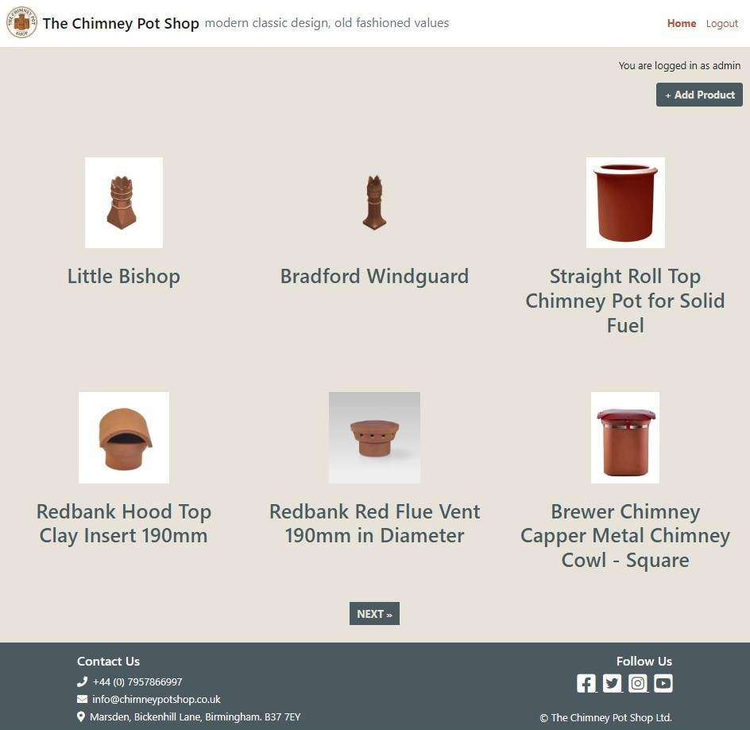

## Tablet
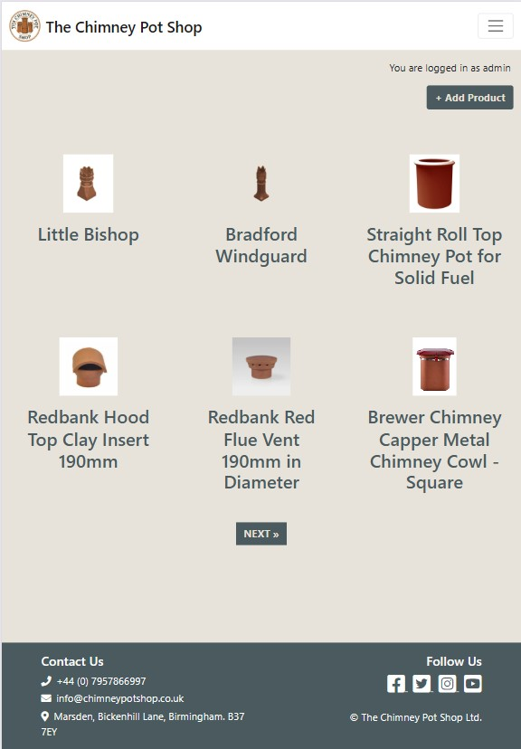

## Mobile

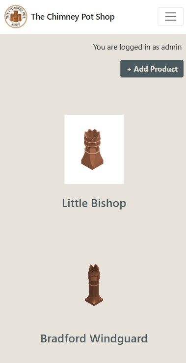

## UX Design

Font Awesome icons were used for the site icons, e.g. the social media icons in the footer.

**Lato** font was used for the primary headers and titles.

Browser default font was used for all other secondary text.

## Colour Palette

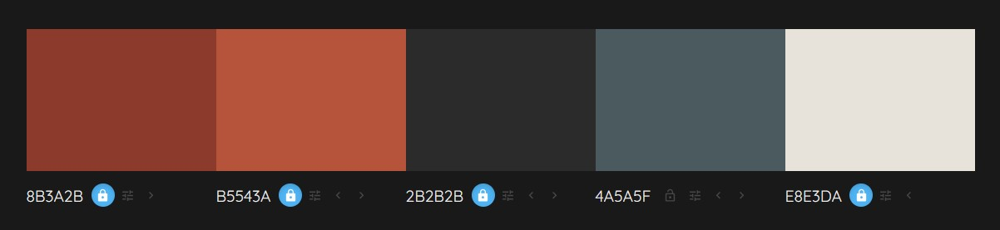

A simple colour palette was chosen to feel solid, traditional, and trustworthy, with natural tones that reference clay, brick, slate, and mortar.

## Home Page Wireframe Design

These are the original concept wireframe diagrams. 
Time constraints meant that not all features could be implemented.  This will be completed in a later sprint.  
The pagination will also change as more products are added.  It has been set at 3 per row, 6 per page to show the NEXT and PREV button funtion.

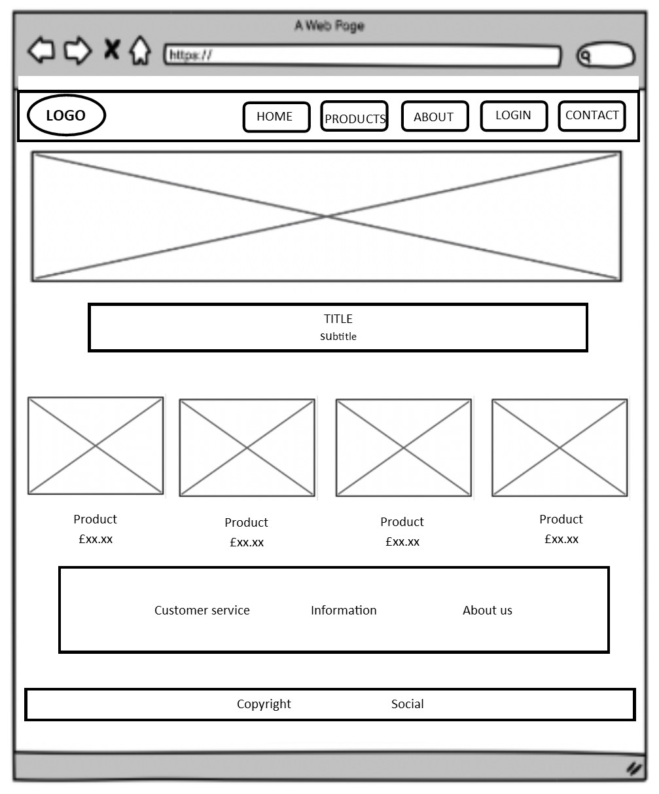

## Product Detail Page Wireframe Design

## User Stories

**As a site admin I want to be able to create, edit and delete products.**
- When logged in as admin, product can be created, edited and deleted from the admin page.
- When logged in as admin, product can be created, edited and deleted from the home page.

**As a site user, I can view a list of products and click on the product I want to view.**
- A list of products is displayed on the front page
- Multiple products are listed and paginated

**As a Site User, I can click on a product so that I can see an image, read the description and see the price.**
- When a product title is clicked, a detailed view of the individual product is displayed.

**As a Site Admin I can create draft products so that I can finish writing the content later, prior to publishing.**
- As a logged in admin, a draft product item can be saved.
- As a logged in admin the content can be finished at a later time.

**As a Site User I can view reviews on an individual product**
- Given one or more user reviews the user can view them without being logged in.

**As a logged in Site User I can leave reviews on a product**
- Reviews are listed on the individual product page

**As a Site User I can modify or delete my review on a product**
- A logged in user can modify their own reviews
- A logged in user can delete their own reviews

**As a site admin I can view reviews in order to filter out objectionable reviews**
- Admin can delete a review

**As a Site User, I can click on the About link and read about the site.**
- When the About link is clicked, the about page is displayed.

**As a Site Admin, I can create or update the about page.**
- The About app is visible in the admin panel
- The About app is accessible to Admin users

**As a site user I can fill in a contact form so that I can submit a message to the site owner.**
- Contact form is submitted and feedback given

**As a Site Admin I can mark contact messages as "read".**
- Admin can mark messages as read

**As a Site User I can register an account so that I can review products.**
- Given an email a user can register an account and log in.
- When the user is logged in they can write a review.

**As a site user/admin I can login so that I can access all of available content.**
- User can login and see the full range of available menus.

**As a site user/admin I can logout so that I can leave the site safely.**
- User/admin can logout successfully

**As a site user I want to be able to search for specific products.**

**As a site user I want to be able to order products.**

**As a site user I want to be able to save favorite products and comment on them.**

The completed sprint was composed of 16 separate items.

Having used the MoSCoW approach to prioritise, 8 were classified as "Must-Have" making up less than 60% of the tasks as recommended. The rest of the first sprint was made up of "Should-Have" and "Could-Have" items. Future development were reflected in the "Wont-Have" items.

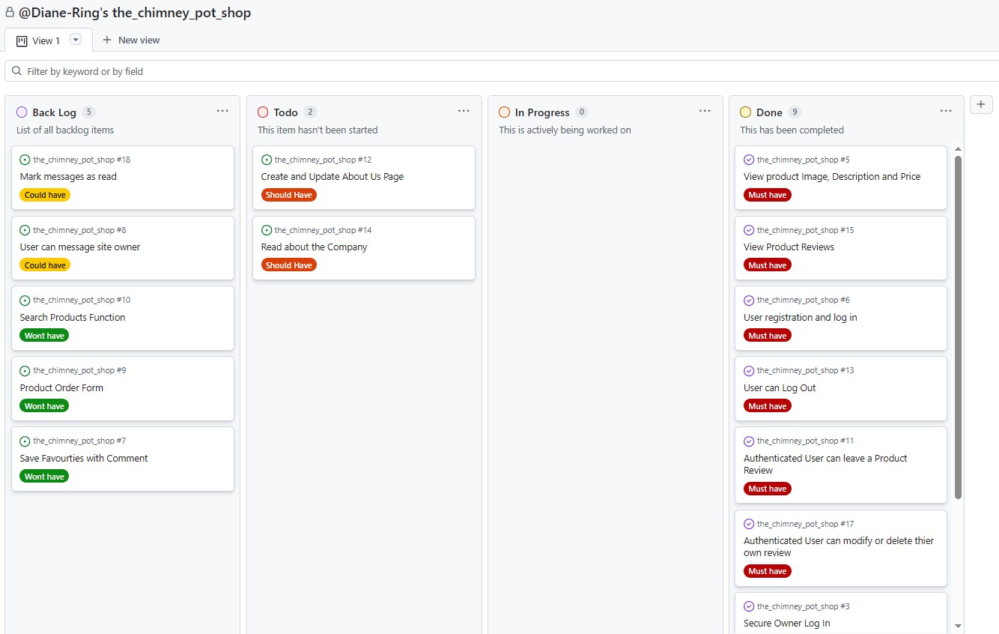

## Features

### Home page

The home page of the site offers users a grid of products. Users can then click on an individual product to read the details. 
 
If the product has any reviews, they are shown underneath the product details.

### Navigation Bar

Navigation is provided via a bootstrap navbar, and is fully responsive.

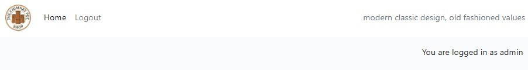

### The Footer

The page footer is a simple arrangement of contact details and 4 social media icons.

### Sign Up

The site has a facility to sign up as a user in order to make, edit or delete your own reviews on products.

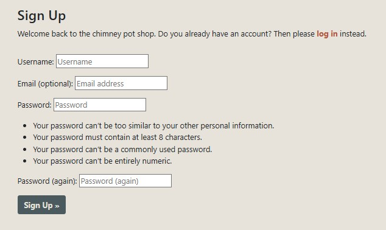

### Log In

The site has a facility to log in, once you have created a user account, in order to make, edit or delete your own reviews on products.

### Log Out

The site has a facility for a user to log out of their account.

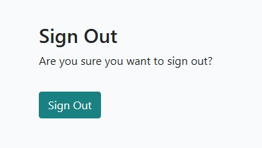

### Add a Review

Only when a user is logged in, can they add a review to any published product. 
This form appears at the bottom of the page. 

A logged in user can also edit or delete their own reviews.
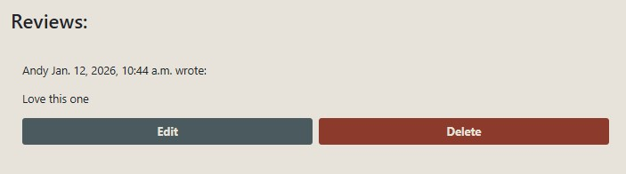

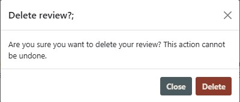

### Admin page

The site has a facility for designated administrators to create a superuser log in, in order to administrate the site via the standard Django admin interface. 
It is from here that all site administration can be done.

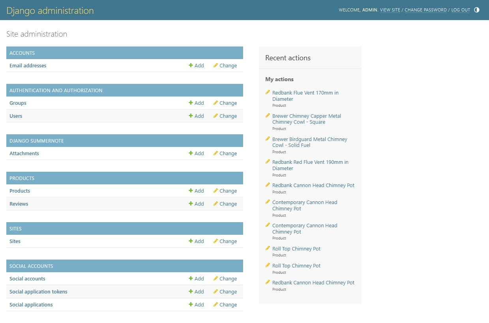

However, the site also has the functionality to Create, Update and Delete products on the main site using the 'admin' log in details.

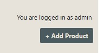

In order to do this the site owner, or staff member would login using the admin credentials
 

The admin will then have access to this Add New Product Form: 
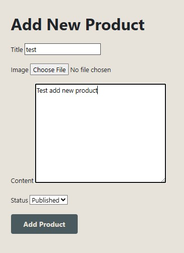

Admin can then add product title, image and content.  The default is set to 'Published', but can be changed to 'draft' if the admin doesn't want the product published straight away.  
If there is no image available, a placeholder 'IMAGE COMING SOON' is displayed. 

Admin can also update and delete any product. When logged in as admin, this displays at the bottom of each product detail page. 
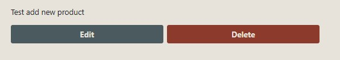

Edit brings up the same form as add new product. 
Delete brings up this form: 
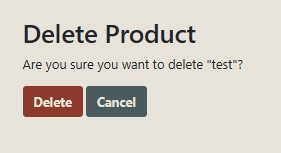
### Entity Relationship Diagram

The following data structure was created for the project.

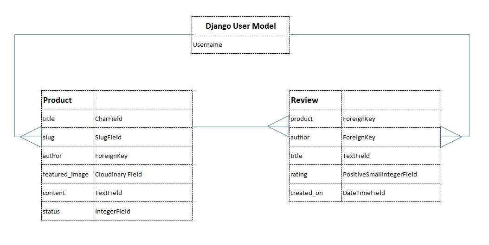

## Testing

### Automated Testing

The Django test suite creates an empty database for testing, using the built-in SQLite3 database, ensuring it is independent of the web browser and our live database. 
The key functionality of the review form was tested using an automated test in Django, using test_form.py. 
Using the _setup_ method, we created a superuser and a small product post in our test database, assigned this data as a variable of the _self_ object. Then we were able to test the views using the _get_ method. We were then able to test a successful review submission on a product using the _post_ method.

### Manual Testing
The site was tested on the following browser for compatibility:

### Chrome ###
|   Test	|  Expected Result 	|  Actual Result	|
|---	|---	|---	|
|   Click Home menu	|  goes to home page 	|  success 	|
|   Click Admin menu	|  shows admin menu 	|  success 	|
|   Click Login menu	|  shows login screen 	|  success 	|
|   Click Logout	|  asks are you sure, with logout button 	|  success 	|
|   Click individual product post	|  goes to product page 	|  success 	|
|   Create a personal review	|  can create a review 	|  success 	|
|   Edit and delete a personal review	|  can edit and delete own reviews	|  success 	|
|   Create a new product logged in as admin	|  can create a new product 	|  success 	|
|   Edit and delete a published product, while logged in as admin	|  can edit and delete products	|  success 	|
|   Register new account	|  new account is created 	|  success 	|
|   Access admin interface	|  admin page appears	|  success 	|
|   Responsivity	|  responsive to all media sizes 	|  success 	|
|   Open new page from social media links	|  opens social media page 	|  success 	|

### User Story Test Table (must-haves only)
| **User Story** | **Expected Result** | **Actual Result** |
|----------------|---------------------|-------------------|
| As a site admin I want to be able to create, edit and delete products. | When logged in as admin, products can be created, edited, and deleted from the admin page. |  success 	|
| As a site user, I can view a list of products and click on the product I want to view. | A list of products is displayed on the front page. Multiple products are listed and paginated. |  success  |
| As a site user, I can click on a product so that I can see an image, read the description and see the price. | When a product title is clicked, a detailed view of the individual product is displayed. |  success  |
| As a site admin I can create draft products so that I can finish writing the content later, prior to publishing. | A logged‑in admin can save a draft product. A logged‑in admin can finish the content later. |  success  |
| As a site user I can view reviews on an individual product. | Given one or more user reviews, the user can view them. Admin can also view them. |  success  |
| As a site user I can leave reviews on a product. | Reviews appear on the product page. |  success  |
| As a site user I can modify or delete my review on a product. | A logged‑in user can modify their own review. A logged‑in user can delete their own review. |   success  |
| As a site user I can register an account so that I can review products. | User can register with an email and log in. Logged‑in users can leave reviews. |   success 	|
| As a site user/admin I can log in so that I can access all available content. | User/admin can log in and see the full range of available menus. |   success 	|
| As a site user/admin I can log out so that I can leave the site safely. | User/admin can log out successfully. |   success 	|

### Lighthouse
The site was tested using Lighthouse with the following results:

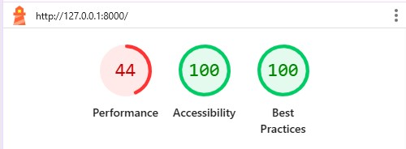

The performance score was negatively affected by:

- Chrome extensions

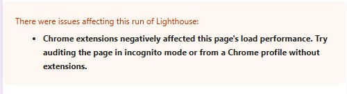

- Download time of images

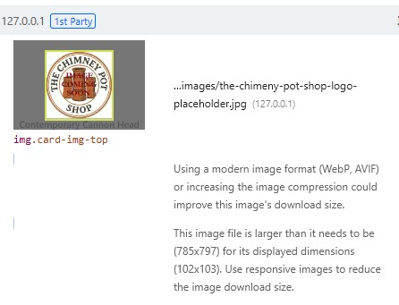

- No cache time
- Document request latency

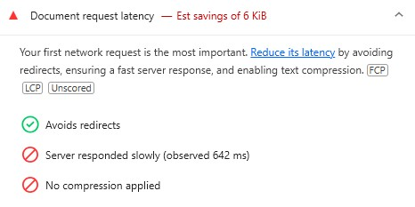

- Rendering being blocked by requests from Bootstrap, CSS and jsDelivr.
- Font display
- layout shifts

The solution to the issues that are slowing the performance can be investigated at a later time, but as there is a hard deadline for submission it has not been possible to do that yet.

Performance can also be affected by internet traffic routing, performance of the device being used, browser extensions, and antivirus software, all of which are out of the control of the website.

However, the site was tested again the next day and had an improved Performance score of 97%.  The issues raised in the first test will still be looked into.

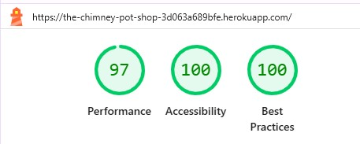

### Responsive Testing

In addition to the built in Bootstrap responsive CSS, Chrome dev tools were used often during the build to test the site at desktop, tablet and mobile. The site was also manually viewed on laptops, tablets and phones.    

### Validator Testing
- HTML
    - No errors found with the HTML code.

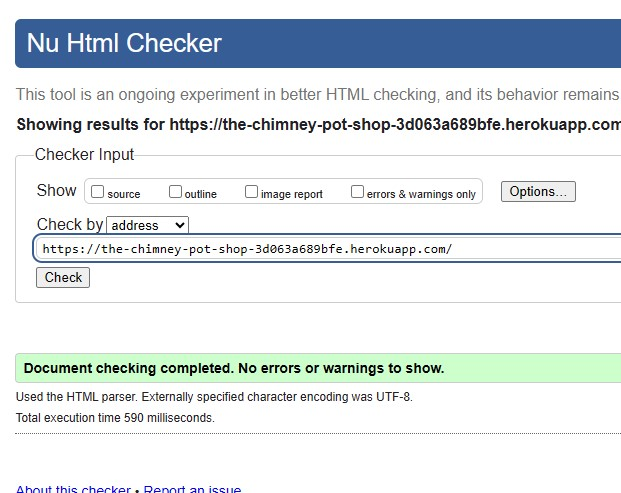

- CSS
    - No errors were found with the CSS code.

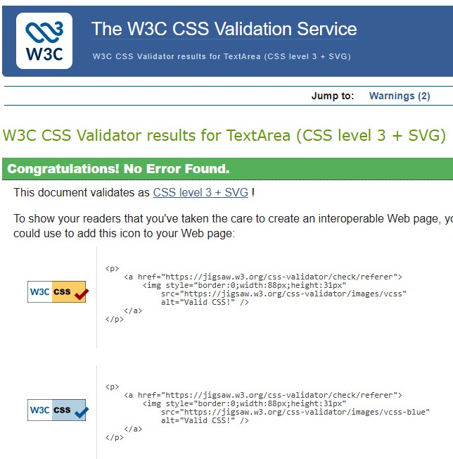

- Python
    - Co-pilot checked all python code against PEP8 standards  
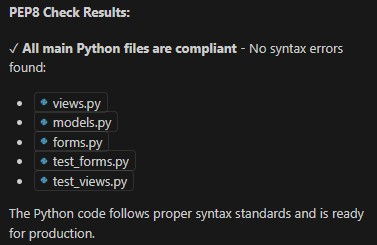
    
## Accessibility Testing

Accessibility Checker (https://www.accessibilitychecker.org/) was used to test accessibility to UK standards. The tool offers two free tests before requiring a paid plan subscription.
Both the home page and product page failed on not having `<h>`Titles`</h>`.  These titles have now been added. 
WCAG contrast checker was used to check contrast compliance of text and background colours. These passed at AA standard.

## AI Usage and Methodology

### Overview
- AI assistance supported debugging, documentation, Django templates, CSS layout, code creation, code optimisation, generated unit tests, and test repairs.
- Primary goal: streamline routine edits and debugging while keeping design decisions and reviews manual.

### Tools
- GitHub Copilot: chat and inline suggestions were used for unit tests, formatting, code fixes, debugging, and documentation structure.

### Scope
- README conversion from HTML to standard Markdown.
- Test suite creation, diagnosis and fixes.
- Minor model and view clarifications.

### Safeguards
- Manual review of all AI-suggested changes.
- Tests run and fixed until passing 
- PEP 8 adherence and template validation checks.

### Notable AI Assistance
- Any Heroku loading or syntax errors were copied and pasted into Copilot for easy corrections.
- Creating automated unit tests.
- README.md: Markdown normalization, image alt text, link structure, section layout; planned but user-reverted “AI Usage & Methodology” section and added it manually.
- base.html: Corrected  usage, fixed navbar anchor tag, set logo size.
- index.html: Cleaned duplicate root tags, adjusted Bootstrap columns (2/3/4 per-row), row break logic, pagination block handling.

- style.css: Image container centering, .card-title min-height alignment, vendor-prefixed transform details.
- test_forms.py: Fixed assert syntax.
- test_views.py: Corrected URL name, removed non-existent model fields, added follow=True for redirects.

### Limitations
- Layout choices were kept minimal; some suggestions (e.g., enforced aspect ratios) were intentionally deferred.
- GitHub README sanitization limits HTML attributes like target="_blank".

### Attributions
- AI assistance (GitHub, Copilot, ChatGPT) was used for routine improvements, deployment issues and bug fixing.  Using AI saved a huge amount of time in debugging, typo fixing and error correction with Heroku deployment issues.  Copilot assisted with spacing issues for the product cards, but was unable to solve the problem. All final decisions and validations were performed manually.

## Deployment

### Heroku

The site was deployed to Heroku from the main branch of the repository early in the development stage for continuous deployment and checking.

The Heroku app is setup with 3 environment variables, replacing the environment variables stored in env.py (which doesn't get pushed to GitHub).

In order to create a Heroku app:

1. Click on New in the Heroku dashboard, and Create new app from the menu dropdown.
2. Give your new app a unique name, and choose a region, preferably one that is geographically closest to you.
3. Click "Create app"
4. In your app settings, click on "Reveal Config Vars" and add the environment variables for your app.  These are:
   - DATABASE_URL - your database connection string
   - SECRET_KEY - the secret key for your app
   - CLOUDINARY_URL - the Cloudinary url for your image store

Once the app setup is complete, click on the Deploy tab and:
1. Connect to the required GitHub account
2. Select the repository to deploy from
3. Click the Deploy Branch button to start the deployment.
4. Once deployment finishes the app can be launched by clicking on the view button.

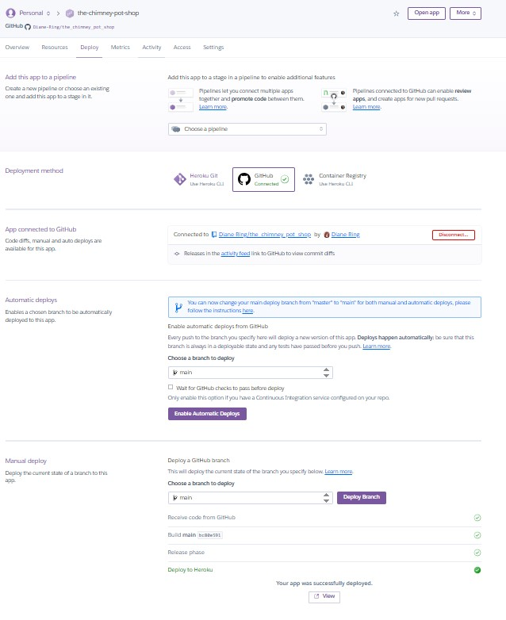

The live link can be found [_here_](https://the-chimney-pot-shop-3d063a689bfe.herokuapp.com/) Ctrl+Click/Middle-click to open in a new tab.

### Local Development Setup

#### Prerequisites
- Python 3.12 installed
- Visual Studio Code installed
- Git installed
- Use bash terminal

#### Step-by-Step Instructions

1. **Clone the Repository** 

   git clone https://github.com/yourusername/the-chimney-pot-shop.git
   cd the-chimney-pot-shop
   

2. **Create a Virtual Environment** 
   python -m venv venv
   

3. **Activate the Virtual Environment**
   - **Windows:**
     source .ven/Scripts/activate
    
   - **Mac/Linux:**
     source venv/bin/activate  

4. **Install Dependencies** 
   pip install -r requirements.txt
   
5. **Create Environment Variables File**
   - Create a file called `env.py` in the root directory
   - **Make sure `env.py` is listed in your `.gitignore` file** (to prevent sensitive data being pushed to GitHub)

   - Add the following (replace with your own values): 

     import os
     
     os.environ.setdefault("SECRET_KEY", "your-secret-key-here") 
     os.environ.setdefault("DATABASE_URL", "your-database-url-here") 
     os.environ.setdefault("CLOUDINARY_URL", "your-cloudinary-url-here") 
     os.environ.setdefault("DEBUG", "True") 
     

6. **Check Django Settings** 
Make sure:
   - manage.py exists in the project root
   - settings.py is correctly configured
   - DEBUG = True (for local use)

7. **Run Database Migrations** 
   python manage.py migrate
   
8. **Create a Superuser (Admin Account)** 
   python manage.py createsuperuser
   
   Follow the prompts to create your admin account.

9. **Collect Static Files** 
   python manage.py collectstatic --noinput
   

10. **Run the Development Server** 
   python manage.py runserver
   

11. **Access the Site**
    - In the terminal press `CTRL` and click on the http: link shown.  OR
    - Open your browser and go to: `http://127.0.0.1:8000/`
    - Admin panel: `http://127.0.0.1:8000/admin/`

#### Stopping the Server
Press `Ctrl+C` in the terminal to stop the development server.

#### Common problems

- Command not found: Python is not installed or not in PATH
- Module not found: Virtual environment not activated
- Port already in use: Stop other servers or run: 
python manage.py runserver 8001

## Credits

This project is based on the 'Codestar' project from Code Institute's LMS and 'Broken Lines Blog' by Mark Briscoe.  
[_Copilot_](#ai-usage-and-methodology) has also requested a mention in the credits.

All content copyright The Chimney Pot Shop Ltd. 2026
